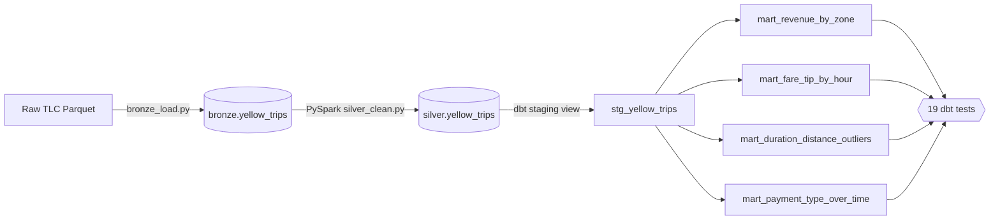

# NYC Taxi Medallion Pipeline

End-to-end data pipeline over NYC TLC Yellow Taxi trips: raw Parquet →
PySpark cleaning → dbt analytics marts → data-quality tests → Airflow orchestration,
all on a DuckDB warehouse.

**Run results:** 2,500,000 raw rows across 2 months → PySpark dropped 194,018 bad rows (7.76%)
→ 2,305,982 clean trips → 4 gold marts + 19 dbt tests, all passing.


## Architecture

```
NYC TLC Yellow Parquet (data/raw/)
        │
        ▼
[BRONZE]  ingestion/bronze_load.py        raw load → bronze.yellow_trips (DuckDB)
        │
        ▼
[SILVER]  ingestion/silver_clean.py       PySpark: drop bad rows, typecast,
        │                                 add trip_duration_min → silver.yellow_trips
        ▼
[GOLD]    dbt_project/models/marts/*.sql  4 business marts (tables)
        │                                 + staging view + zone seed
        ▼
[TESTS]   dbt build                       not_null · unique · accepted_values ·
        │                                 relationships · 2 singular tests (19 total)
        ▼
[ORCH]    airflow/dags/nyc_taxi_dag.py    daily DAG: bronze → silver → gold+tests
```



## Gold marts
| Mart | What it answers |
|---|---|
| `mart_revenue_by_zone` | Revenue and trip count by pickup zone/borough |
| `mart_fare_tip_by_hour` | Average fare and tip % by hour of day |
| `mart_duration_distance_outliers` | Suspicious trips flagged for review with reason |
| `mart_payment_type_over_time` | Payment method share of trips and revenue per month |

## Data quality tests (19, all passing)

`not_null` and `unique` on mart keys · `accepted_values` for payment codes, hours, and
outlier reasons · `relationships` from `pickup_location_id` to the zone seed · 2 singular
tests checking no bad fares or invalid passenger counts made it through silver.
Full results: [`results/dbt_test_results.txt`](results/dbt_test_results.txt).

```
Done. PASS=19 WARN=0 ERROR=0 SKIP=0 NO-OP=0 TOTAL=19
```

## Repo layout
```
nyc-taxi-pipeline/
  ingestion/        config.py · bronze_load.py · silver_clean.py (PySpark)
  dbt_project/      models/staging · models/marts · tests · seeds · profiles.yml
  airflow/dags/     nyc_taxi_dag.py
  infra/            docker-compose.yml (local Airflow + Postgres)
  scripts/          get_data.py · run_pipeline.sh · make_results_chart.py
  results/          run_metrics.json · dbt_test_results.txt · gold_results.png
  notebooks/        exploration notes
```

## How to run

```bash
pip install -r requirements.txt        # needs Java 8/11/17 for PySpark
bash scripts/run_pipeline.sh           # bronze → silver → gold + tests + docs
```

To use Airflow instead:
```bash
cd infra && docker compose up airflow-init && docker compose up
# then open http://localhost:8080  (user/pass: airflow / airflow)
```

## Stack
PySpark 3.5 · dbt-core 1.11 + dbt-duckdb 1.10 · DuckDB 1.5 · Airflow 2.10

## Data

The pipeline works with either real or synthetic data. To use the real TLC files
(no login needed), download them and drop them in `data/raw/`:

```
https://d37ci6vzurychx.cloudfront.net/trip-data/yellow_tripdata_2024-01.parquet
https://d37ci6vzurychx.cloudfront.net/trip-data/yellow_tripdata_2024-02.parquet
https://d37ci6vzurychx.cloudfront.net/misc/taxi_zone_lookup.csv   # -> dbt_project/seeds/
```

If you can't download them, `scripts/get_data.py` generates synthetic data with the
exact TLC schema and the same kinds of defects (negative fares, zero-distance trips,
bad timestamps) so the cleaning logic still gets tested properly. The numbers above
came from that synthetic run — the 7.76% drop is real cleaning on real defects.
