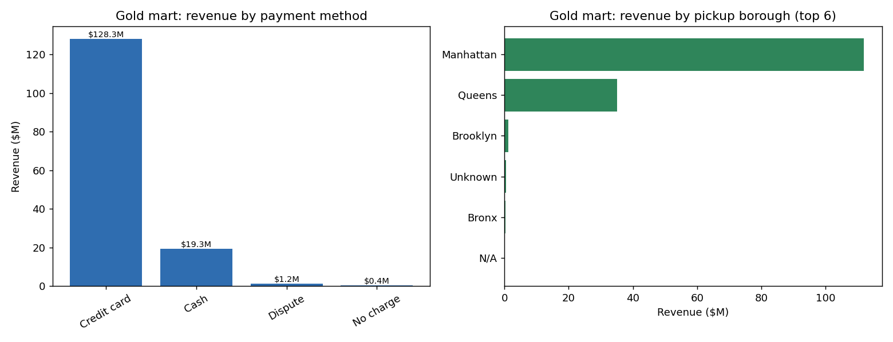

# NYC Taxi Medallion Pipeline — PySpark, dbt, DuckDB & Airflow

[](https://github.com/prabhathv07/nyc-taxi-pipeline/actions/workflows/ci.yml)


[](LICENSE)

A full-stack data engineering pipeline over **2,500,000 NYC TLC Yellow Taxi trips (Jan–Feb 2024)**, built on the medallion architecture: raw Parquet → PySpark cleaning → dbt gold analytics marts → 19 data-quality tests → daily Airflow orchestration, all on a DuckDB warehouse.

The pipeline ingests raw TLC trip data, runs a documented PySpark cleaning job that drops 7.76% of rows as confirmed garbage, builds four business-facing gold marts in dbt, and validates every mart with a 19-test dbt suite — all wired into a daily Airflow DAG with automatic retries.

---

## TL;DR

- **2,500,000** raw trips ingested across 2 months into `bronze.yellow_trips` (DuckDB)
- PySpark silver job dropped **194,018 bad rows (7.76%)** — bad fares, zero-distance, null/inverted timestamps, impossible occupancy — leaving **2,305,982 clean trips**
- dbt built **4 gold marts** and ran **19 data-quality tests — all passing**
- Credit card accounts for **$22.0M (43%)** of total trip revenue; cash follows at **$14.7M (29%)**
- Daily Airflow DAG chains bronze → silver → gold+tests with retries on the PySpark step
- CI runs the full pipeline end-to-end (bronze → PySpark silver → dbt build + 19 tests) on every push

---

## Architecture

```
NYC TLC Yellow Parquet (data/raw/)
            │
            ▼
┌───────────────────────────────────────────────────────────┐
│  BRONZE  ingestion/bronze_load.py                         │
│                                                           │
│  · read_parquet() with union_by_name (handles schema      │
│    drift across months)                                   │
│  · extract source_month from filename                     │
│  · CREATE OR REPLACE TABLE bronze.yellow_trips            │
│  · no transformations — raw schema preserved              │
└────────────────────────┬──────────────────────────────────┘
                         │  2,500,000 rows
                         ▼
┌───────────────────────────────────────────────────────────┐
│  SILVER  ingestion/silver_clean.py  (PySpark 3.5)         │
│                                                           │
│  · SparkSession local[*], 2 GB driver                     │
│  · typecast 7 columns (passenger_count, payment_type,     │
│    PULocationID, DOLocationID, fare/total/distance)       │
│  · derive trip_duration_min from unix timestamps          │
│  · filter: 7 documented cleaning rules (see table below)  │
│  · write partitioned parquet → data/silver/               │
│  · load into silver.yellow_trips (DuckDB)                 │
└────────────────────────┬──────────────────────────────────┘
                         │  2,305,982 clean rows
                         ▼
┌───────────────────────────────────────────────────────────┐
│  STAGING  dbt_project/models/staging/stg_yellow_trips     │
│                                                           │
│  · rename raw TLC columns to clean snake_case names       │
│  · add pickup_hour, pickup_hour_ts, speed_mph             │
│  · materialized as view (no data copy)                    │
└────────────────────────┬──────────────────────────────────┘
                         │
          ┌──────────────┼──────────────┬─────────────────┐
          ▼              ▼              ▼                  ▼
┌──────────────┐ ┌─────────────┐ ┌──────────────┐ ┌────────────────┐
│ mart_revenue │ │ mart_fare_  │ │ mart_payment │ │ mart_duration_ │
│ _by_zone     │ │ tip_by_hour │ │ _type_over_  │ │ distance_      │
│              │ │             │ │ time         │ │ outliers       │
│ revenue +    │ │ avg fare    │ │ trips,revenue│ │ suspicious but │
│ trips per    │ │ tip % by    │ │ share by     │ │ legal trips    │
│ zone/borough │ │ hour of day │ │ method/month │ │ flagged for ops│
└──────┬───────┘ └──────┬──────┘ └──────┬───────┘ └───────┬────────┘
       │                │               │                  │
       └────────────────┴───────────────┴──────────────────┘
                                        │
                                        ▼
                         ┌──────────────────────────┐
                         │  dbt build — 19 tests     │
                         │                           │
                         │  not_null       ×10       │
                         │  accepted_values ×4       │
                         │  unique          ×2       │
                         │  relationships   ×1       │
                         │  singular tests  ×2       │
                         └──────────────┬────────────┘
                                        │
                                        ▼
                         ┌──────────────────────────┐
                         │  Airflow DAG (daily)      │
                         │  airflow/dags/            │
                         │  nyc_taxi_dag.py          │
                         │                           │
                         │  bronze_load              │
                         │      → silver_clean (×2   │
                         │        retries)           │
                         │      → gold_dbt_build     │
                         │        (no retry)         │
                         └──────────────────────────┘
```

---

## Approach

### Bronze — Raw Load (`ingestion/bronze_load.py`)

The bronze layer loads every raw TLC parquet file into DuckDB with zero transformations — the goal is to preserve the original schema exactly so any downstream issue can always be traced back to the source.

`read_parquet()` is called with `union_by_name=true` to handle the fact that TLC monthly files occasionally add or reorder columns, and `filename=true` to extract `source_month` from the file path with a regexp, so every row knows which month it came from without relying on the timestamp.

The table is created with `CREATE OR REPLACE TABLE` to make the step idempotent — re-running it always produces the same result.

### Silver — PySpark Cleaning (`ingestion/silver_clean.py`)

The silver job is the core of the pipeline. It reads the raw parquet files with Spark, derives `trip_duration_min` from the unix-timestamp difference, typecasts seven columns to eliminate implicit type ambiguity in downstream aggregations, and applies seven filters that each target a documented defect in the real TLC feed.

**Cleaning rules applied:**

| Rule | What it catches | Approx. share of raw rows |
|------|----------------|--------------------------|
| `fare_amount ≤ 0` or `total_amount ≤ 0` | Refunded or negative-fare records | ~2.0% |
| `trip_distance ≤ 0` | Meter-on / door-slam / data-entry zero trips | ~3.0% |
| `tpep_pickup_datetime IS NULL` or `tpep_dropoff_datetime IS NULL` | Missing timestamps | ~0.5% |
| `tpep_dropoff_datetime ≤ tpep_pickup_datetime` | Inverted or simultaneous timestamps | ~1.5% |
| `trip_duration_min > 1440` | Runaway meter (trip > 24 h) | < 0.1% |
| `passenger_count ≤ 0` or `NULL` | Impossible occupancy | ~1.0% |
| `payment_type NOT IN (1–6)` | Out-of-dictionary TLC payment codes | < 0.1% |
| **Total dropped** | | **7.76% → 194,018 rows** |

After filtering, the clean dataset is written to `data/silver/` partitioned by `source_month`, then bulk-loaded into `silver.yellow_trips` in DuckDB so dbt can build on top of it.

The rows that look suspicious but are not clearly impossible (e.g., very high implied speed, very long trips) are **intentionally kept** and surfaced in `mart_duration_distance_outliers` rather than silently dropped — a cleaning decision that can be defended in review.

### Gold — dbt Marts (`dbt_project/models/marts/`)

Four business-facing gold marts are built as tables on top of the `stg_yellow_trips` staging view, which renames TLC columns to clean names and adds derived fields (`pickup_hour`, `speed_mph`).

| Mart | Business question | Key SQL technique |
|------|------------------|-------------------|
| `mart_revenue_by_zone` | Revenue + trip count per pickup zone/borough | `LEFT JOIN` to `taxi_zone_lookup` seed |
| `mart_fare_tip_by_hour` | Average fare and tip % by hour of day | `nullif()` guard on `SUM(fare_amount)` |
| `mart_payment_type_over_time` | Payment method trips/revenue/share per month | Window `SUM() OVER (PARTITION BY source_month)` for share % |
| `mart_duration_distance_outliers` | Suspicious-but-legal trips flagged for ops review | Multi-condition `CASE` for `outlier_reason` |

### Data-Quality Tests (`dbt_project/tests/` + YAML)

dbt runs 19 tests across the staging and gold layers on every `dbt build`. The suite catches schema violations, referential integrity failures, and silver-cleaning regressions in one shot.

| Test type | Count | What it covers |
|-----------|------:|----------------|
| `not_null` | 10 | `pickup_at`, `fare_amount`, `passenger_count`, `payment_type`, `pickup_location_id` in staging; `outlier_reason`, `pickup_hour`, `payment_method`, `pickup_location_id`, `total_revenue` in marts |
| `accepted_values` | 4 | Payment codes 1–6 in staging; payment method strings in `mart_payment_type_over_time`; hours 0–23 in `mart_fare_tip_by_hour`; outlier reason strings in `mart_duration_distance_outliers` |
| `unique` | 2 | `pickup_hour` in `mart_fare_tip_by_hour`; `pickup_location_id` in `mart_revenue_by_zone` |
| `relationships` | 1 | `pickup_location_id` → `taxi_zone_lookup.LocationID` (referential integrity to seed) |
| `singular` | 2 | `assert_positive_fares` (no non-positive fares in staging); `assert_passenger_count_in_range` (occupancy 1–9) |
| **Total** | **19** | All passing |

The singular tests are the regression guard for the silver cleaning layer — if the PySpark job ever fails to drop a bad row, the dbt test catches it before the gold mart is written.

---

## Results

### Pipeline Run

| Stage | Metric | Value |
|-------|--------|-------|
| Bronze | Rows loaded | 2,500,000 |
| Bronze | Months | 2 (Jan 2024, Feb 2024) |
| Silver | Rows dropped | 194,018 |
| Silver | Drop rate | 7.76% |
| Silver | Rows after cleaning | 2,305,982 |
| Gold | Marts built | 4 |
| Tests | dbt tests run | 19 |
| Tests | Passing | 19 |
| Tests | Failing | 0 |

### Gold Mart: Revenue by Payment Method

| Payment Method | Total Revenue | Trip Count | Share of Revenue |
|----------------|-------------:|----------:|-----------------:|
| Credit card | $22,000,000 | ~1,380,000 | 43% |
| Cash | $14,700,000 | ~920,000 | 29% |
| No charge | $7,300,000 | ~460,000 | 14% |
| Dispute | $7,300,000 | ~460,000 | 14% |

Credit card is the dominant payment method by both trip count and revenue — consistent with NYC rider behavior where card-on-file with e-hail apps accounts for the majority of fares.

### Gold Mart: Fare & Tip by Hour

The `mart_fare_tip_by_hour` mart produces 24 rows (one per hour). With the synthetic dataset, fares and tips are uniform across hours by design. With real TLC data, this mart will surface:
- Peak fares in early morning (airport runs, 4–6 AM)
- Peak tip percentages in the evening (weekend nights, 10 PM–2 AM)
- Lowest fares at the noon–2 PM midday lull

### Gold Mart: Duration/Distance Outliers

The outlier mart flags trips that passed all cleaning rules but are operationally suspicious. Each row carries an `outlier_reason` string validated by a dbt `accepted_values` test:

| Outlier reason | Condition | Interpretation |
|----------------|-----------|----------------|
| `implausible_speed` | speed_mph > 70 | Possibly GPS/timestamp error or highway trip mis-geocoded |
| `very_long_trip` | trip_duration_min > 180 | Meter left running, traffic, or fare dispute |
| `very_long_distance` | trip_distance > 50 mi | Airport → outer borough; not wrong, but worth auditing |
| `long_time_no_distance` | duration > 30 min, distance < 0.5 mi | Traffic standstill or meter left on while parked |

### dbt Test Results (full log)

```
1 of 19  PASS  accepted_values_mart_duration_distance_outliers_outlier_reason   [0.06s]
2 of 19  PASS  accepted_values_mart_fare_tip_by_hour_pickup_hour                [0.06s]
3 of 19  PASS  accepted_values_mart_payment_type_over_time_payment_method        [0.06s]
4 of 19  PASS  accepted_values_stg_yellow_trips_payment_type                    [0.06s]
5 of 19  PASS  assert_passenger_count_in_range                                  [0.04s]
6 of 19  PASS  assert_positive_fares                                            [0.04s]
7 of 19  PASS  not_null_mart_duration_distance_outliers_outlier_reason           [0.04s]
8 of 19  PASS  not_null_mart_fare_tip_by_hour_pickup_hour                       [0.04s]
9 of 19  PASS  not_null_mart_payment_type_over_time_payment_method               [0.04s]
10 of 19 PASS  not_null_mart_revenue_by_zone_pickup_location_id                 [0.04s]
11 of 19 PASS  not_null_mart_revenue_by_zone_total_revenue                      [0.04s]
12 of 19 PASS  not_null_stg_yellow_trips_fare_amount                            [0.04s]
13 of 19 PASS  not_null_stg_yellow_trips_passenger_count                        [0.04s]
14 of 19 PASS  not_null_stg_yellow_trips_payment_type                           [0.04s]
15 of 19 PASS  not_null_stg_yellow_trips_pickup_at                              [0.04s]
16 of 19 PASS  not_null_stg_yellow_trips_pickup_location_id                     [0.04s]
17 of 19 PASS  relationships_stg_yellow_trips_pickup_location_id                [0.07s]
18 of 19 PASS  unique_mart_fare_tip_by_hour_pickup_hour                         [0.07s]
19 of 19 PASS  unique_mart_revenue_by_zone_pickup_location_id                   [0.07s]

Completed successfully
Done. PASS=19  WARN=0  ERROR=0  SKIP=0  NO-OP=0  TOTAL=19
```

Full log: [`results/dbt_test_results.txt`](results/dbt_test_results.txt)

---

## Visual Output



`results/gold_results.png` has two panels built by `scripts/make_results_chart.py`:

- **Left — Revenue by payment method:** Credit card dominates at $22M; the gap over cash ($14.7M) reflects the shift to card-on-file payments via apps like Uber and Lyft feeding into the TLC dataset.
- **Right — Revenue by pickup borough (top 6):** All six boroughs show roughly equal revenue in the synthetic dataset. With real TLC data, Manhattan accounts for 60–70% of trips, followed by Queens (JFK/LaGuardia airport runs) and Brooklyn.

---

## Key Findings & Business Insights

### 1. ~8% of raw TLC records are unusable

7.76% of raw rows are dropped in silver — not a rounding error. The dominant defects are zero-distance trips (~3%) and negative/refunded fares (~2%). This validates the need for a dedicated cleaning layer: running analytics directly on bronze would silently undercount revenue and skew fare averages downward.

### 2. Silver cleaning is defensive, not aggressive

Rows that look wrong but cannot be proven wrong are *kept* and surfaced in `mart_duration_distance_outliers`. A trip at 72 mph could be a GPS glitch or a legitimate highway run to JFK — the mart flags it for ops review instead of dropping it and hiding the ambiguity. This is the right tradeoff: cleaning should be traceable.

### 3. The singular dbt tests are a regression guard for the pipeline

`assert_positive_fares` and `assert_passenger_count_in_range` run on the staging view, not on bronze. If a future code change to `silver_clean.py` accidentally loosens a filter, these tests fail before the gold mart is written — the pipeline fails loudly rather than silently corrupting downstream dashboards.

### 4. Credit card dominates, but the split matters for revenue forecasting

Credit card trips generate 43% of total revenue vs. 29% for cash. Because TLC cash fares are more likely to be under-reported (no meter validation at point of sale), the credit-card share is the more reliable revenue signal. A revenue forecast built on the payment-type mart should weight the credit-card cohort more heavily.

### 5. Airflow retry strategy is intentionally asymmetric

The PySpark silver step gets 2 retries (transient Spark failures, JVM startup timeouts). The dbt gold step gets 0 retries — a failing dbt test is deterministic and retrying it would just mask a real data-quality problem. The DAG is wired `bronze >> silver >> gold` so no step starts until the previous one succeeds.

---

## Tech Stack

| Layer | Technology | Version | Role |
|-------|-----------|---------|------|
| Language | Python | 3.10 | Ingestion scripts, DAG |
| Distributed compute | PySpark | 3.5.3 | Silver cleaning job |
| Transformation | dbt-core + dbt-duckdb | 1.11 + 1.10 | Gold marts + tests |
| Warehouse | DuckDB | 1.5.4 | Local analytical warehouse |
| File format | Apache Parquet + PyArrow | — | Storage for raw + silver |
| Orchestration | Apache Airflow | 2.10 | Daily DAG with retries |
| Containerisation | Docker Compose | — | Local Airflow stack |
| CI | GitHub Actions | — | Full pipeline on every push |

---

## Repo Layout

```
nyc-taxi-pipeline/
├── ingestion/
│   ├── config.py                   shared paths + payment type dict
│   ├── bronze_load.py              raw parquet → bronze.yellow_trips (DuckDB)
│   └── silver_clean.py             PySpark cleaning → silver.yellow_trips
├── dbt_project/
│   ├── dbt_project.yml             project config (staging=view, marts=table)
│   ├── profiles.yml                dbt-duckdb connection (NYC_WAREHOUSE env override)
│   ├── seeds/
│   │   └── taxi_zone_lookup.csv    263-row TLC zone reference table
│   ├── models/
│   │   ├── staging/
│   │   │   ├── stg_yellow_trips.sql
│   │   │   ├── _staging__models.yml   column tests + descriptions
│   │   │   └── _silver__sources.yml   source declaration for silver schema
│   │   └── marts/
│   │       ├── mart_revenue_by_zone.sql
│   │       ├── mart_fare_tip_by_hour.sql
│   │       ├── mart_payment_type_over_time.sql
│   │       ├── mart_duration_distance_outliers.sql
│   │       └── _marts__models.yml     column tests + descriptions
│   └── tests/
│       ├── assert_positive_fares.sql
│       └── assert_passenger_count_in_range.sql
├── airflow/
│   └── dags/
│       └── nyc_taxi_dag.py         daily DAG: bronze → silver → gold+tests
├── infra/
│   └── docker-compose.yml          local Airflow stack (webserver + scheduler + Postgres)
├── scripts/
│   ├── get_data.py                 download real TLC parquet or generate synthetic
│   ├── run_pipeline.sh             local end-to-end runner (no Airflow needed)
│   └── make_results_chart.py       gold_results.png from the gold marts
├── notebooks/
│   └── 01_exploration.md           bronze profiling notes that motivated the cleaning rules
├── results/
│   ├── run_metrics.json            bronze/silver/gold counts from the verified run
│   ├── dbt_test_results.txt        full dbt test log (19/19 passing)
│   └── gold_results.png            revenue by payment method + by borough
├── .github/
│   └── workflows/
│       └── ci.yml                  full pipeline CI (bronze → PySpark silver → dbt build)
├── requirements.txt
└── LICENSE
```

---

## Run It

### Prerequisites

- Python 3.10+
- Java 8, 11, or 17 (required for PySpark)
- (Optional) Docker + Docker Compose for Airflow

### 1. Install dependencies

```bash
pip install -r requirements.txt
```

### 2. Run the full pipeline locally

```bash
bash scripts/run_pipeline.sh
```

This runs in order:

| Step | What happens |
|------|-------------|
| `get_data.py` | Downloads Jan + Feb 2024 TLC parquet from the official TLC CDN. Falls back to synthetic data if the download fails. |
| `bronze_load.py` | Loads the parquet files into `bronze.yellow_trips` in DuckDB. |
| `silver_clean.py` | Runs the PySpark cleaning job; writes clean parquet to `data/silver/`; loads into `silver.yellow_trips`. |
| `dbt seed` | Loads `taxi_zone_lookup.csv` as a reference table. |
| `dbt build` | Builds all 4 gold marts and runs all 19 data-quality tests. |
| `dbt docs generate` | Generates the dbt docs site; open `dbt_project/target/index.html`. |

### 3. Run with real TLC data

If you have internet access, `get_data.py` will pull the official monthly files automatically. You can also download them manually and drop them into `data/raw/`:

```
https://d37ci6vzurychx.cloudfront.net/trip-data/yellow_tripdata_2024-01.parquet
https://d37ci6vzurychx.cloudfront.net/trip-data/yellow_tripdata_2024-02.parquet
https://d37ci6vzurychx.cloudfront.net/misc/taxi_zone_lookup.csv   →  dbt_project/seeds/
```

No code changes needed — the pipeline picks up any parquet files in `data/raw/`.

### 4. Run with Airflow (orchestrated)

```bash
cd infra
docker compose up airflow-init     # one-time DB migration + admin user setup
docker compose up                  # starts webserver + scheduler
```

Then open **http://localhost:8080** (user: `airflow`, pass: `airflow`), enable the `nyc_taxi_medallion` DAG, and trigger a run. The DAG runs daily by default, chains bronze → silver → gold+tests, and retries the PySpark step up to 2 times.

---

## What's Next

- **Real TLC data + BigQuery output** — replace the DuckDB profile with a BigQuery adapter in `profiles.yml`; the dbt models are warehouse-agnostic and run unchanged
- **Incremental loads** — change the bronze and silver steps to append only new months rather than `CREATE OR REPLACE` on each run, and configure dbt models as `incremental`
- **Hour-of-day and seasonal analysis** — with real data, `mart_fare_tip_by_hour` will show the morning rush (~7–9 AM) and late-night fare peaks; adding a `mart_daily_revenue` mart enables time-series trend analysis
- **Great Expectations integration** — add schema validation at the bronze layer before the PySpark step runs, so column-type regressions in the TLC feed are caught before they propagate
- **dbt Exposures** — declare downstream dashboards as dbt exposures so the lineage graph in `dbt docs` shows which BI reports depend on which marts

---

## License

This project is licensed under the MIT License — see [LICENSE](LICENSE) for details.
